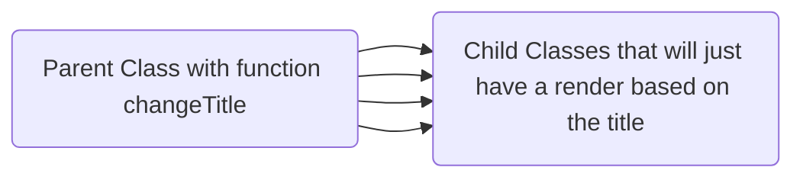

# Entrance Test

Hello ! You are about to do a test at entrance for OrangeMaple.
There is some prerequisites to make it possible to us to evaluate you.

- You will need NodeJS
- You will need Git and a GitHub account

You first have to clone this repository by typing
```
git clone https://github.com/OrangeMaple22/EntranceTest.git
```
After you created this repository, you will create a branch that will have your name, it will be the branch you will work on.
\
Then, you will need to install the packages with this command :
```
yarn install // If you are on Windows or MacOS
yarnpkg install // If you are on Linux
```
And that is done ! You know just have to run this command to start to work
```
yarn run start // If you are on Windows or MacOS
yarnpkg run start // If you are on Linux
```

## I] The Test
It consists on creating a toolbar, that you will need to integrate from a Figma file, and there will be some actions to handle onClick into the button.
\
You start from file App.js in src, you have to create one file per Class.
\
Each of the buttons will create a React Component, that will be added to the DOM, they will all have a function that will change the title of the page (First *\<h1>\</h1>*), this function have to be inherited from a Parent Class, so this is the scheme

The render of the child components will be activated on Click
They will display the previous text inside the Title (First \<h1>\</h1>) and add the number of the button inside a \<h4>\</h4>.
When it is done, this click  will change the Title of the page.
You are free to use whatever you want, this test is about Inheritance, React components and integration.
Feel free to ask any questions during this test.
You have one day ! Good luck !
\
Good to know :
```
The objectives of the test is to understand how you structure
your code with specific rules.
We then will have a talk about how you handle all of this.
```
